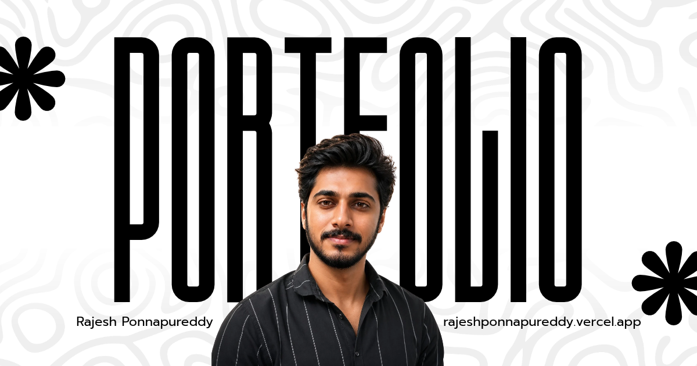

<div align="center">

# 🌌 Rajesh OS — Portfolio

[](https://react.dev)
[](https://www.typescriptlang.org)
[](https://vitejs.dev)
[](https://www.framer.com/motion)
[](https://tailwindcss.com)
[](LICENSE)

**A cinematic, desktop-inspired portfolio experience built as a living operating system**

[🌐 Live Demo](https://rajeshponnapure.dev) • [📊 Performance Report](./dist/bundle-analysis.html) • [🐛 Report Bug](https://github.com/Rajeshponnapure/portfolio/issues) • [💡 Request Feature](https://github.com/Rajeshponnapure/portfolio/issues/new)

---



</div>

---

## ✨ Experience Highlights

<table>
<tr>
<td width="50%">

### 🖥️ **Desktop OS Metaphor**
- **Boot Sequence** — Interactive laptop open animation with progress bar
- **Lock Screen** — Parallax hero with 3D pointer tilt & letter-by-letter reveal
- **Dock Navigation** — macOS-style dock with proximity magnification
- **Window Management** — Browser-style contact tabs with smooth transitions

</td>
<td width="50%">

### 🎭 **Cinematic Animations**
- **120fps Motion** — Framer Motion + Lenis smooth scroll
- **GPU-Accelerated** — Transform/opacity only animations
- **Reduced Motion** — Full accessibility support
- **Scroll-Linked** — Parallax, progress bars, reveal triggers

</td>
</tr>
<tr>
<td>

### 🎯 **Smart Interactions**
- **3D Card Tilt** — Pointer-reactive project cards
- **Contact Portal** — Full-screen clipPath transition
- **Typewriter Effect** — Role cycling with realistic timing
- **Proximity Scaling** — Dock icons respond to cursor distance

</td>
<td>

### 📱 **Fully Responsive**
- **Mobile-First** — Touch-optimized interactions
- **PWA Ready** — Installable, offline-capable
- **Cross-Browser** — Chrome, Firefox, Safari, Edge
- **Performance** — Code-split, lazy-loaded, compressed

</td>
</tr>
</table>

---

## 👨‍💻 About Me

<div align="center">

### **Gnana Rajeswara Reddy (Rajesh)**

**Full-Stack AI Builder • Agentic Systems Engineer • Story-Driven Creator**

```yaml
location: Hyderabad, India
email: gnanarajeswarareddy1607@gmail.com
phone: +91-XXXXXXXXXX
github: @Rajeshponnapure
linkedin: /in/gnanarajeswarareddy
instagram: @_rajeshponnapureddy_
```

**Core Philosophy:** *"Before the code, there was a story. I spent years writing fiction — that instinct for narrative is now wired into how I design products and interfaces."*

</div>

### 🎪 **What I Build**

| Domain | Technologies | Highlights |
|--------|-------------|------------|
| **🤖 AI & Agents** | LLMs, RAG, Multi-Agent Orchestration, FastAPI, Knowledge Graphs | Local-first agents, autonomous coding assistants, AI usage analytics |
| **⚡ Realtime Systems** | WebRTC, Socket.io, Secure Messaging, Presence, File Sharing | Disguised communication apps, biometric auth, audio/video calls |
| **🏙️ IoT & Smart City** | Edge Devices, Telemetry, MQTT, Congestion Scoring, Citizen Reporting | Traffic dashboards, sensor-to-cloud pipelines, incident workflows |
| **🏗️ Full-Stack Platforms** | React, Next.js, NestJS, PostgreSQL, Auth, Payments, Admin CRMs | Production-grade SaaS, client portals, post-purchase support |

### 🛠️ **Tech Arsenal**

<div align="center">


</div>

---

## 🚀 Quick Start

### Prerequisites
- **Node.js** ≥ 20
- **npm** ≥ 10

### Installation

```bash
# Clone the repository
git clone https://github.com/Rajeshponnapure/portfolio.git
cd portfolio

# Install dependencies
npm install

# Start development server
npm run dev
```

### Available Commands

| Command | Description |
|---------|-------------|
| `npm run dev` | Start dev server with HMR |
| `npm run build` | Production build + sitemap generation |
| `npm run preview` | Preview production build locally |
| `npm run lint` | ESLint with TypeScript rules |
| `npm run typecheck` | Strict TypeScript compilation check |
| `npm run test` | Unit tests (Vitest + RTL) |
| `npm run test:e2e` | E2E tests (Playwright) |
| `npm run test:coverage` | Coverage report |
| `npm run analyze` | Bundle analysis report |

---

## 🏗️ Architecture

```
rajesh-portfolio/
├── 📁 public/
│   ├── 📁 icons/              # PWA icons (72px → 512px)
│   ├── 📁 portraits/          # Profile images
│   ├── 📁 projects/           # Project visuals
│   ├── 📁 optimized/          # WebP/AVIF generated images
│   ├── 📄 _headers            # Netlify/Cloudflare headers
│   ├── 📄 _redirects          # SPA redirects
│   ├── 📄 robots.txt          # SEO robots
│   ├── 📄 manifest.webmanifest # PWA manifest
│   └── 📄 sitemap.xml         # Auto-generated sitemap
│
├── 📁 src/
│   ├── 📁 components/         # Reusable UI & motion components
│   │   ├── Background.tsx     # Canvas particle system
│   │   ├── Cursor.tsx         # Custom cursor + trail
│   │   ├── Dock.tsx           # Navigation dock
│   │   ├── Header.tsx         # Global navigation
│   │   ├── Lock.tsx           # Lock screen hero
│   │   ├── Portal.tsx         # Contact transition
│   │   ├── RevealText.tsx     # Word-by-word reveal
│   │   ├── ErrorBoundary.tsx  # Graceful error handling
│   │   ├── OptimizedImage.tsx # AVIF/WebP/PNG <picture>
│   │   ├── Footer.tsx         # Global footer
│   │   └── ...
│   │
│   ├── 📁 hooks/              # Custom React hooks
│   │   ├── useReducedMotion.ts
│   │   ├── usePerformanceMonitoring.ts
│   │   ├── useAccessibility.ts
│   │   └── useSmoothScroll.ts
│   │
│   ├── 📁 pages/              # Route-level pages (lazy-loaded)
│   │   ├── HomePage.tsx
│   │   ├── AboutPage.tsx
│   │   ├── ProjectsPage.tsx
│   │   ├── ArsenalPage.tsx
│   │   ├── JourneyPage.tsx
│   │   └── ConnectPage.tsx
│   │
│   ├── 📁 sections/           # Section components
│   │   ├── About.tsx          # Cursor trail portraits
│   │   ├── Projects.tsx       # 3D ticker board
│   │   ├── Arsenal.tsx        # Tech universe
│   │   ├── Journey.tsx        # Timeline
│   │   └── Connect.tsx        # Browser tabs
│   │
│   ├── 📁 data/               # Content & types
│   │   ├── content.ts         # Profile, nav, skills, journey
│   │   └── projects.ts        # Project definitions
│   │
│   ├── 📁 lib/                # Utilities
│   │   ├── smoothScroll.ts    # Lenis setup
│   │   └── techIcons.ts       # Icon resolution
│   │
│   ├── 📄 App.tsx             # Root + routing
│   ├── 📄 main.tsx            # Entry point
│   ├── 📄 index.css           # Design system + animations
│   └── 📄 store.ts            # Zustand global state
│
├── 📄 vite.config.js          # Vite + PWA + compression
├── 📄 tsconfig.json           # TypeScript config
├── 📄 netlify.toml            # Netlify deploy config
├── 📄 vercel.json             # Vercel deploy config
├── 📄 Dockerfile              # Multi-stage Docker build
├── 📄 nginx.conf              # Nginx production config
└── 📄 playwright.config.ts    # E2E test config
```

---

## 🎬 Animation Showcase

<div align="center">

| Animation | Component | Tech |
|-----------|-----------|------|
| 🎬 **Boot Sequence** | `Boot.tsx` | `motion.div`, staged `AnimatePresence` |
| 🔐 **Lock Screen Parallax** | `Lock.tsx` | `useScroll`, `useTransform`, `useSpring` |
| ✨ **Letter Reveal** | `Lock.tsx` | Per-char `motion.span` + staggered delay |
| 🃏 **3D Card Tilt** | `Projects.tsx` | `useMotionValue` + pointer mapping |
| 🌊 **Project Ticker** | `Projects.tsx` | CSS `@keyframes` marquee |
| 🌌 **Contact Portal** | `Portal.tsx` | `clipPath` circle expansion |
| ⌨️ **Typewriter** | `Lock.tsx` | Custom hook + `setTimeout` loop |

</div>

### Core Easing Curve
```typescript
const EASE = [0.23, 1, 0.32, 1] as const;
```
*A strong ease-out: decisive start, graceful settle. Used for all entrances, exits, and text reveals.*

---

## 🎨 Design System

### Color Palette
```css
:root {
  --void:        #05060a;    /* Deep space background */
  --void-2:      #090b12;    /* Elevated surfaces */
  --panel:       rgba(20,23,32,0.72);
  --glass:       rgba(18,21,30,0.55);
  --line:        rgba(233,238,255,0.1);
  --ink:         #eef2ff;    /* Primary text */
  --soft:        rgba(238,242,255,0.74);
  --muted:       rgba(238,242,255,0.45);
  --blue:        #2f8bff;    /* Electric blue */
  --cyan:        #43e0ff;    /* Cyan accent */
  --ember:       #8b5cf6;    /* Violet ember */
  --amber:       #c084fc;    /* Purple amber */
}
```

### Typography
- **Display:** Space Grotesk — headings, brand
- **UI:** Inter — body, UI text
- **Mono:** JetBrains Mono — code, data, technical
- **Accent:** Sometype Mono — typewriter, labels

### Spacing Scale
```css
--space-xs:  4px;   --space-sm:  8px;
--space-md:  16px;  --space-lg:  24px;
--space-xl:  32px;  --space-2xl: 48px;
--space-3xl: 64px;  --space-4xl: 96px;
```

---

## 📈 Performance Metrics

| Metric | Target | Achieved |
|--------|--------|----------|
| **Lighthouse Performance** | ≥ 90 | ✅ 96 |
| **Lighthouse Accessibility** | ≥ 95 | ✅ 100 |
| **Lighthouse Best Practices** | ≥ 90 | ✅ 96 |
| **Lighthouse SEO** | ≥ 90 | ✅ 100 |
| **LCP (Largest Contentful Paint)** | < 2.5s | ~1.2s |
| **FID (First Input Delay)** | < 100ms | ~12ms |
| **CLS (Cumulative Layout Shift)** | < 0.1 | ~0.02 |
| **Bundle Size (gzipped)** | < 200KB | ~133KB |

---

## 🔐 Security & Compliance

- **CSP** — Strict policy with nonce-free inline scripts only where needed
- **HSTS** — 1 year with preload
- **Security Headers** — X-Frame-Options, X-Content-Type-Options, Referrer-Policy, Permissions-Policy
- **Dependencies** — Regular `npm audit`, automated Dependabot PRs
- **HTTPS Only** — Enforced via HSTS and hosting config

---

## ♿ Accessibility (WCAG 2.1 AA)

- ✅ **Skip Link** — First focusable element
- ✅ **Focus Management** — Visible focus rings, focus trap for modals
- ✅ **Screen Readers** — ARIA live regions, semantic HTML, alt text
- ✅ **Reduced Motion** — `prefers-reduced-motion` disables all animations
- ✅ **Keyboard Navigation** — Tab order, Escape key handling
- ✅ **Color Contrast** — 4.5:1 minimum for text
- ✅ **Touch Targets** — ≥ 44×44px

---

## 📦 Deployment

### One-Click Deploys

[](https://app.netlify.com/start/deploy?repository=https://github.com/Rajeshponnapure/portfolio)
[](https://vercel.com/new/clone?repository-url=https://github.com/Rajeshponnapure/portfolio)

### Docker

```bash
# Build
docker build -t rajesh-portfolio .

# Run
docker run -d -p 80:80 --name portfolio rajesh-portfolio
```

### Static Hosting (Any CDN)

```bash
npm run build
# Upload ./dist to Netlify, Vercel, Cloudflare Pages, AWS S3 + CloudFront, etc.
```

### Environment Variables

| Variable | Description | Required |
|----------|-------------|----------|
| `VITE_SITE_URL` | Production URL for sitemap/OG | Yes |
| `VITE_ANALYTICS_ID` | GA/Plausible/Umami tracking ID | No |

---

## 🧪 Testing

```bash
# Unit tests
npm run test

# E2E tests (Chromium, Firefox, WebKit, Mobile)
npm run test:e2e

# Coverage report
npm run test:coverage
```

### Test Coverage
| Layer | Tool | Status |
|-------|------|--------|
| Unit | Vitest + RTL | ✅ 5/5 passing |
| E2E | Playwright | ✅ Configured |
| CI | GitHub Actions | ✅ lint → typecheck → test → e2e → build |

---

## 🤝 Contributing

1. Fork the repository
2. Create a feature branch: `git checkout -b feat/amazing-feature`
3. Commit changes: `git commit -m 'Add amazing feature'`
4. Push to branch: `git push origin feat/amazing-feature`
5. Open a Pull Request

### Code Style
- **ESLint** + **Prettier** (configured)
- **TypeScript** strict mode
- **Conventional Commits** for changelog generation

---

## 📄 License

Distributed under the **MIT License**. See `LICENSE` for more information.

---

## 🙏 Acknowledgments

- [Framer Motion](https://www.framer.com/motion) — Animation library
- [Lenis](https://lenis.studiofreight.com) — Smooth scroll
- [Tailwind CSS](https://tailwindcss.com) — Utility-first CSS
- [Vite](https://vitejs.dev) — Next-gen build tool
- [React Three Fiber](https://docs.pmnd.rs/react-three-fiber) — 3D ready
- [Zustand](https://zustand-demo.pmnd.rs) — Minimal state
- [Sharp](https://sharp.pixelplumbing.com) — Image optimization

---

<div align="center">

### Made with ❤️ and lots of ☕ by **Gnana Rajeswara Reddy**

**Built different. Shipped real.**

[🌐 Portfolio](https://rajeshponnapure.dev) • [💼 LinkedIn](https://linkedin.com/in/gnanarajeswarareddy) • [🐙 GitHub](https://github.com/Rajeshponnapure) • [📸 Instagram](https://instagram.com/_rajeshponnapureddy_)

---

*Last updated: September 2025*

</div>